# Wii Bowling 2 - Final Project (Computer Graphics)

## Description
Wii Bowling 2 is a mock-up rendition of the classic Wii Sports Bowling. Giving the player control over ball power (to an extent), angle, spin (and spin power), Wii Bowling 2 is a semi-realistic interpretation of a bowling alley with resettable pins and numerical scoring (i.e. not real bowling scoring). 
Made using Unity, Wii Bowling 2 runs smoothly, provides a realistic physics-based experience at the players fingertips, and engages with lighting as expected from a realistic experience.

## Assumptions
- 16:9 aspect ratio is expected for user interface.

## Model, Texture, Artifact Catalog

- Graphical Background

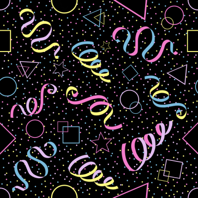

- Wall/Ceiling Texture

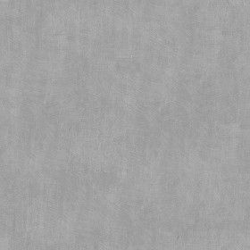

- Lane Texture

- Pin Texture

- Ball Texture

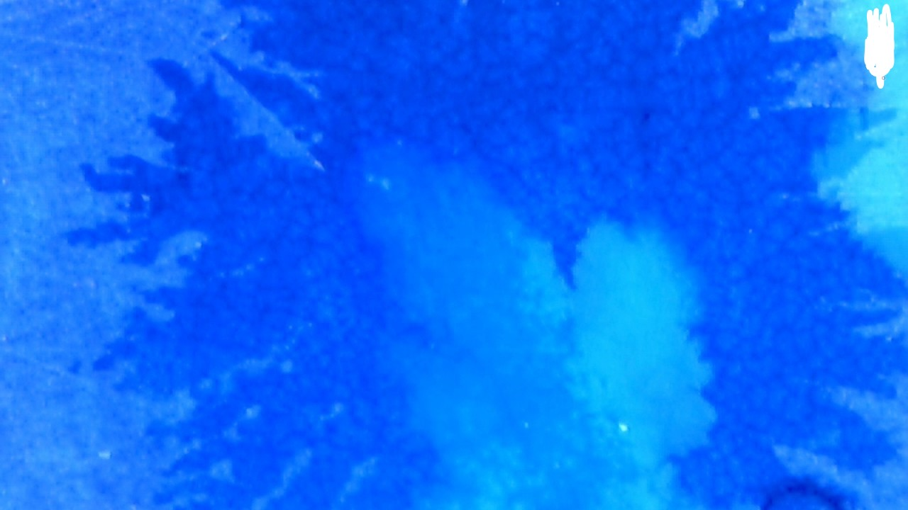

- Light Metal

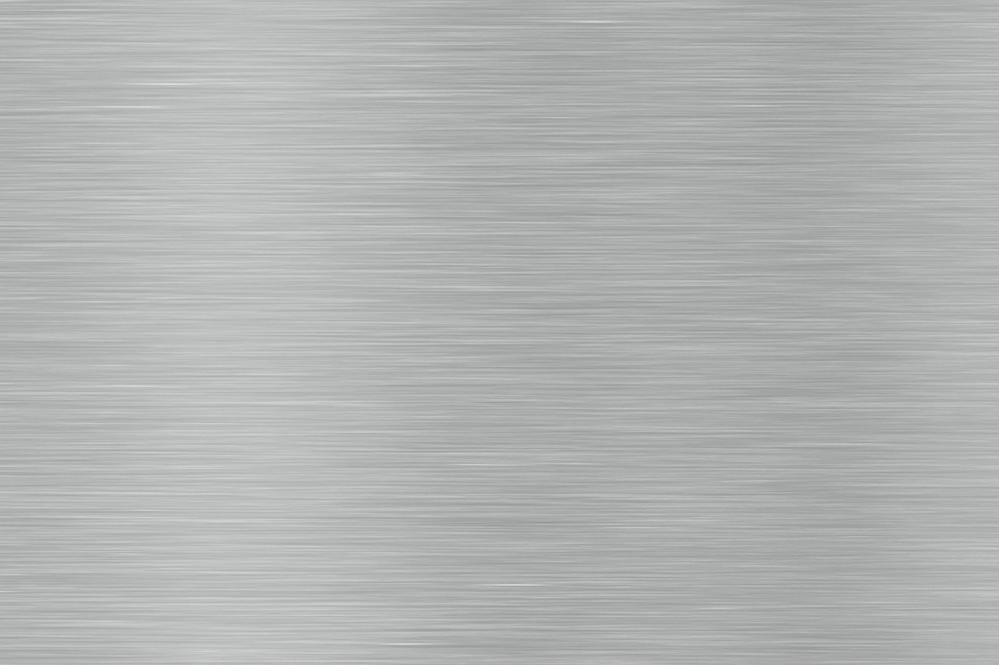

- Pin

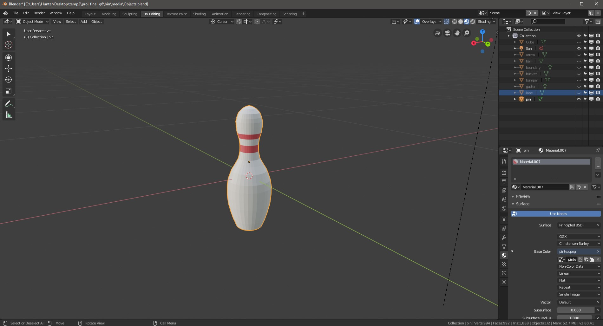

- Lane (Untextured for some reason in blender)

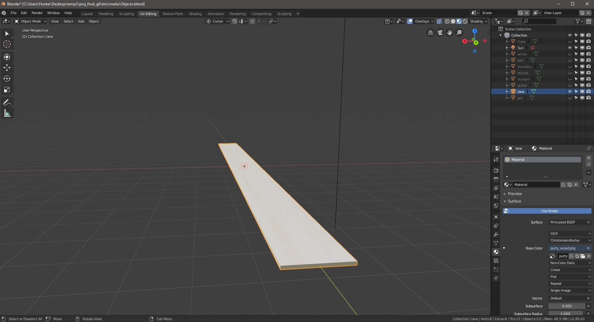

- Gutter

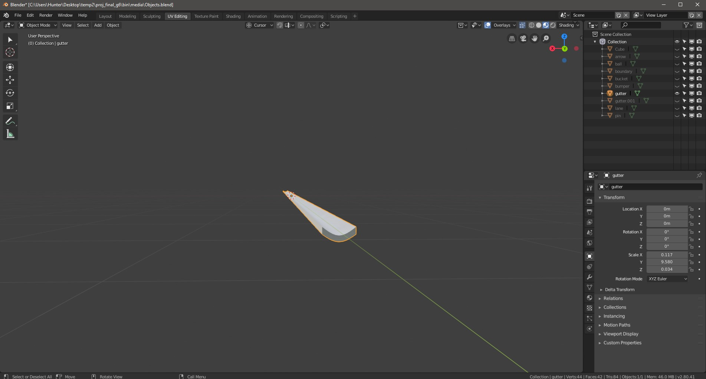

- Bumper

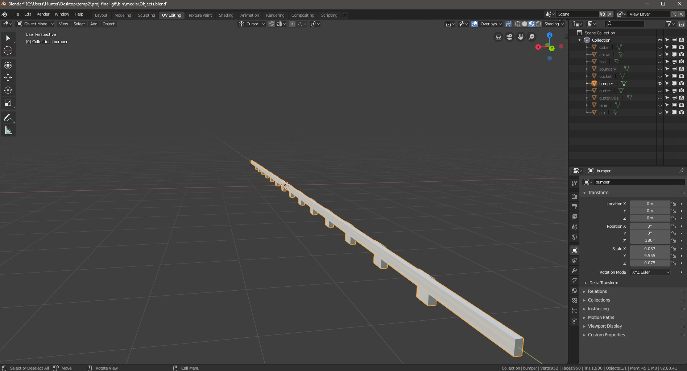

- Pin Collector

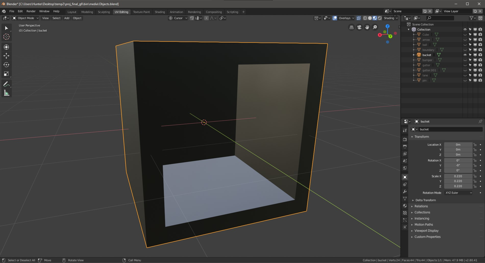

- Lane Spacer

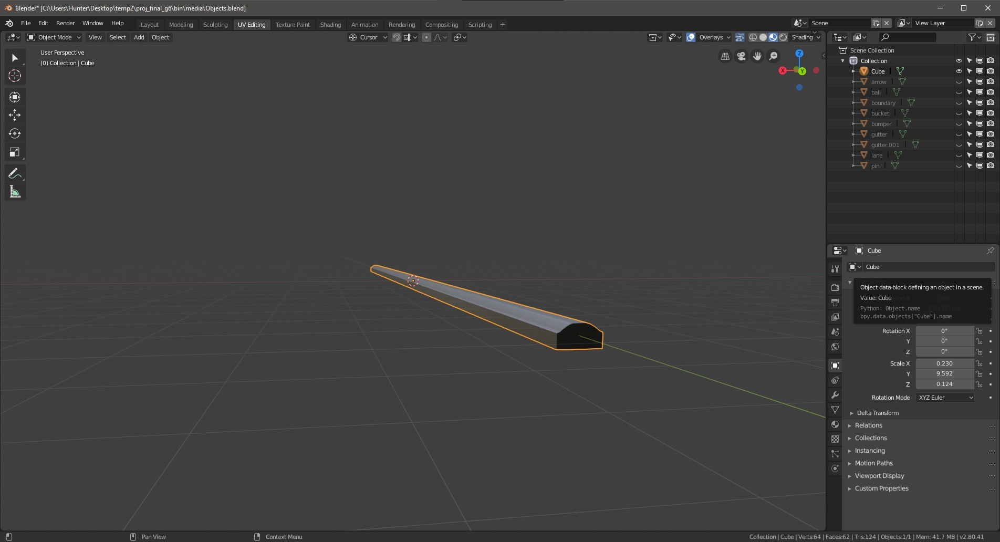

- Ball

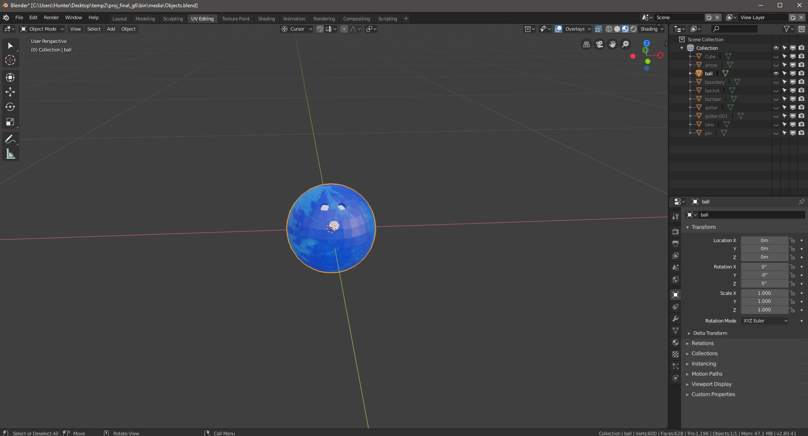

- Arrow

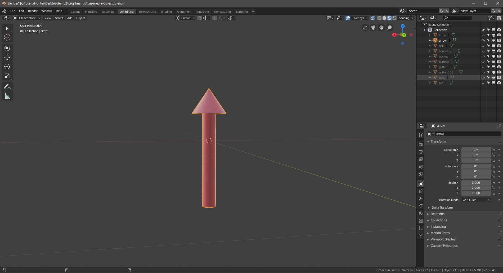

- Collision Box (Also used as the model for walls, just retextured)

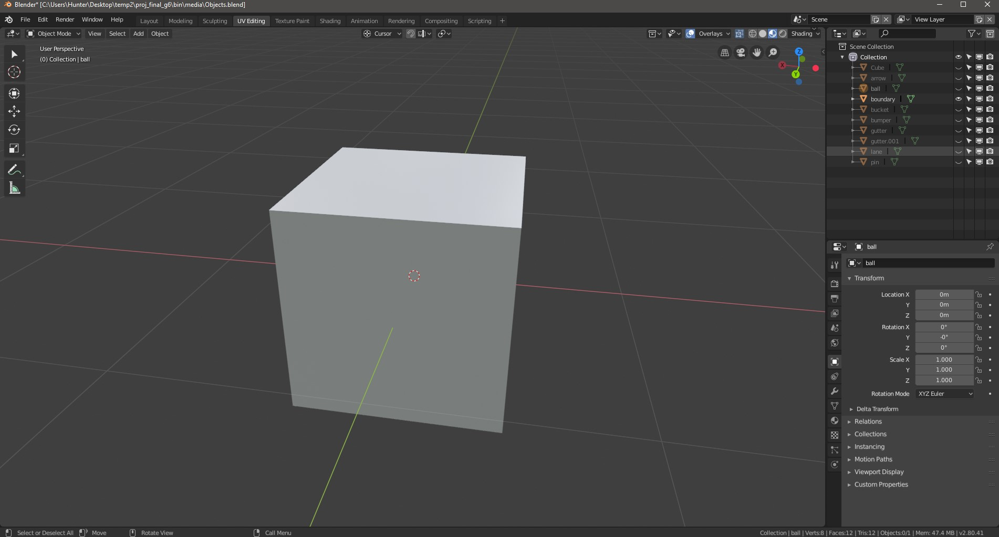

- Ambient Bowling Sounds

https://www.youtube.com/watch?v=G6O-efcU1lM

- Pin Bowling Sounds

https://freesfx.co.uk/Category/Bowling/467 (Trimmed by https://audiotrimmer.com/)

## Interface Flow Chart

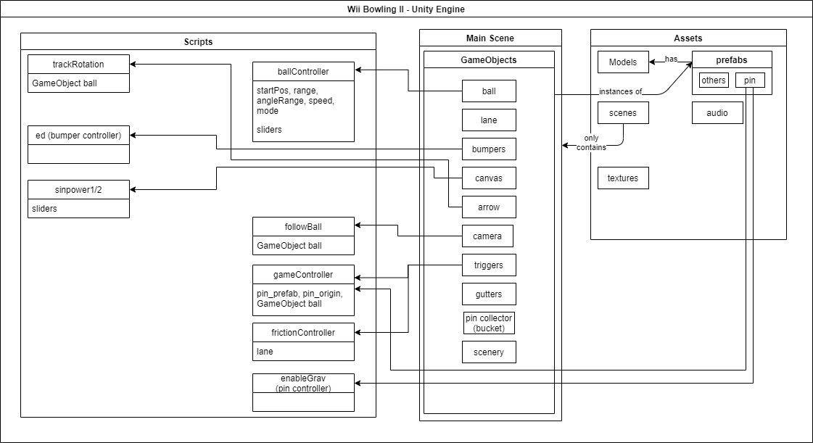
- In this diagram, our GameObjects and Prefabs have scripts, and the items in the list under the scripts represent inputs set in the Unity Inspector
- Scripts directly interact with the scene they are instantiated in, which is their "output"

## Design Analysis and Justification

- Design: We structured our project using the standard layout for Unity projects.
    - Assets
        - Models: 3D models (and textures) using .dae file format
        - Prefabs: Configurable Unity objects. Consist of components for meshes, colliders, rigidbodies, texture mapping, scripting, and much more.
        - Scenes: World space! Essentially these are "levels", but we are only using one, as we would if this were made in OpenGL
        - Scripts: can be attached to Prefabs/GameObjects
            - gameController: keeps track of the status of the game. checks ball and pin positions, places pins programmatically, keeps game score, and resets the ball to the start position.
            - ballController: Lets ball be moved, aimed, spun, and launched when in the start position.
            - followBall: keeps track of ball transform and places host GameObject relative to it depending on ballController mode.
            - trackRotation: Keeps track of the ball's transform and places object relatively to show direction that ball is being aimed in.
            - ed: toggles the existence of a GameObject (or more accurately its mesh, collider, and texture) by the press of the 'B' key
            - pinController: turns on gravity for the GameObject as soon as there is a collision
            - frictionController: Changes friction on last two fifths of the lane to simulate a real lane's difference of oiliness toward the back.
            - sinpower1/2: set ball spin/power based on sine wave and good timing
    - Main Scene
        - GameObjects
            - ball: Main GameObject that we care about (for obvious reasons). Controlled by ballController script.
            - Main Camera: Our game's camera. Uses followBall script to follow ball as it is controlled
            - arrow: Controlled by trackRotation script to show where ball is being aimed.
            - lane: What the ball rolls on. Has slippery collider until last 2 fifths of length, where it changes to a material with more friction.
            - gutters: Stationary. Generally keeps ball from hitting pins if ball enters it.
            - bumpers: Controlled by ed script. can be turned on/off
            - pins: Existence dependent on gameController script to instantiate them and place them programmatically. To avoid problems with them slowly sliding, using the pinController script, they are initially very slightly above the lane surface until they collide with another object.
            - triggers: Invisisble boxes that run a command when the ball passes through them.
                - friction_trigger: Invokes frictionController to make lane less slick.
                - bucket_boundary: Host of gameController script (it has to be attached to something!)
            - canvas: UI elements
                - sliders: connected to sinpower1/2 respectively to control ball spin/power for launch
            - scenery
    - Justification
        - Firstly, we developed our game using standard Unity practices. All of our GameObjects are instaniated prefabs to allow changes in the master object to be carried down to the GameObjects automatically. All of our assets were organized in the expected way, making our game more congruent with example games we have come across. Scripts exist as components of GameObjects, including the main gameController script. Scripts are the developers' way of interacting programmatically with the Unity API on a frame-by-frame basis. Lastly our use of scripts across multiple objects allows each item to be tracked asynchronously by Unity, letting us work faster by abstracting away object interactions from our focus.
        - For simplicity, our entire game takes place in a singular scene. We did not see the need for anything beyond one scene, because it is more of a demo rather than a full game. 
        - The performance of the game exactly matches our expectations and plans for it when starting the project. We are pleased with the physics interactions and how intuitively the objects interact, due to research we performed about real bowling physics and dimensions. In addition, our ball controls are mostly intuitive assisted by the user interface.
        - Lastly, our scene is aesthetically pleasing with non-offensive lighting and a familiar environment inside of a bowling alley. This brings a bit of nostalgia for the BEFORE TIMES (pre-pandemic).

            

## Works Cited
No outside sources were used for anything other than bug fixing and/or ideas on a general scope. Sources for audio are listed below, as well as in the artifact catalog.

- Ambient Bowling Sounds

https://www.youtube.com/watch?v=G6O-efcU1lM

- Pin Bowling Sounds

https://freesfx.co.uk/Category/Bowling/467 (Trimmed by https://audiotrimmer.com/)
